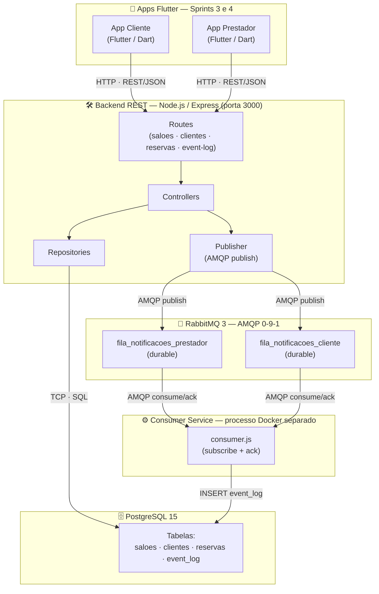

# **SalonManager — `SALON.OS`**

### **Sistema Distribuído para Gestão de Salões de Festas**

> Projeto Integrador · **Lab. de Desenvolvimento de Aplicações Móveis e Distribuídas (LDAMD)**
> Engenharia de Software — **PUC Minas** · 5º Período · Noite · 1º Semestre 2026


---

## Sprint 3 - App Flutter Cliente

Entrega adicionada nesta versao:

- app Flutter em `mobile/salon_manager_client`;
- telas de saloes, detalhes, criacao de reserva, minhas reservas, modo prestador e sistema;
- integracao REST com `/api/saloes`, `/api/clientes`, `/api/reservas`, `/api/event-log` e `/api/system/status`;
- atualizacao assincrona por polling a cada 6 segundos;
- organizacao em Clean Architecture (`core`, `data`, `domain`, `presentation`);
- tela visual com diagrama animado clicavel REST + RabbitMQ + consumer + PostgreSQL.

Execucao:

```bash
docker compose up --build

cd mobile/salon_manager_client
flutter run -d chrome --dart-define=API_BASE_URL=http://localhost:3000
```

Android emulator:

```bash
cd mobile/salon_manager_client
flutter run -d emulator --dart-define=API_BASE_URL=http://10.0.2.2:3000
```

Documentacao da entrega:

- [Arquitetura do app cliente](docs/sprint3/arquitetura-app-cliente.md)
- [Relatorio da Sprint 3](docs/sprint3/relatorio-sprint3.md)

---

## **1. Descrição do Projeto (System Overview)**

O **SalonManager** é um sistema distribuído orientado a eventos para **gestão de reservas de salões de festas**. A plataforma conecta dois perfis de usuário em fluxos assíncronos:

- **Cliente** — pesquisa salões, consulta disponibilidade e solicita reservas.
- **Prestador (gestor)** — recebe solicitações em tempo real, confirma/recusa e atualiza o status.

A arquitetura é construída sobre quatro pilares:

| Componente | Tecnologia | Sprint |
|---|---|---|
| Backend REST | Node.js + Express | Sprint 1 ✅ |
| MOM (mensageria) | RabbitMQ + Consumer Service | Sprint 2 ✅ |
| App móvel do cliente | Flutter | Sprint 3 ✅ ← *atual* |
| App móvel do prestador | Flutter | Sprint 4 |

---

## **2. Pilha de Tecnologias (Core Stack)**

#### **Backend & API**


#### **Persistência**


#### **Mensageria (MOM)**


#### **Mobile (Sprints 3 e 4)**


#### **DevOps & Ferramentas**


---

## **3. Arquitetura do Sistema (Sprint 2)**



**Protocolos por canal:**

| Canal | Protocolo | Formato |
|---|---|---|
| App ↔ Backend | HTTP/HTTPS (REST) | JSON |
| Backend ↔ PostgreSQL | TCP / Postgres wire protocol | SQL via driver `pg` |
| Backend → RabbitMQ | AMQP 0-9-1 (publish) | JSON serializado |
| RabbitMQ → Consumer | AMQP 0-9-1 (consume/ack) | JSON serializado |
| Consumer → PostgreSQL | TCP / Postgres wire protocol | SQL via driver `pg` |

> **Assincronicidade garantida:** `backend` e `consumer` são **containers Docker distintos**.
> Não há chamada REST ou import de módulo entre eles — a única ponte é o RabbitMQ.

---

## **4. Fluxo de Eventos (Sprint 2)**

```
Cliente                Backend API            RabbitMQ           Consumer Service
  │                        │                      │                      │
  │ POST /api/reservas      │                      │                      │
  │──────────────────────► │                      │                      │
  │                        │─── INSERT reserva ──►│DB│                   │
  │                        │─── publish ──────────►│ fila_prestador │    │
  │ ◄── 201 Created ───────│                      │                      │
  │                        │                      │── consume ──────────►│
  │                        │                      │                      │── INSERT event_log
  │                        │                      │◄────── ack ──────────│
  │                        │                      │                      │
  │ PUT /reservas/1/status  │                      │                      │
  │──────────────────────► │                      │                      │
  │                        │─── UPDATE status ───►│DB│                   │
  │                        │─── publish ──────────►│ fila_cliente   │    │
  │ ◄── 200 OK ────────────│                      │                      │
  │                        │                      │── consume ──────────►│
  │                        │                      │                      │── INSERT event_log
  │                        │                      │◄────── ack ──────────│
```

---

## **5. Endpoints REST**

Base URL: `http://localhost:3000`

### Health
| Método | Endpoint | Descrição |
|---|---|---|
| `GET` | `/api/health` | Verifica status do serviço |

### Salões
| Método | Endpoint | Descrição |
|---|---|---|
| `GET` | `/api/saloes` | Lista todos os salões |
| `GET` | `/api/saloes/:id` | Detalhes de um salão |
| `POST` | `/api/saloes` | Cadastra novo salão |

### Clientes
| Método | Endpoint | Descrição |
|---|---|---|
| `GET` | `/api/clientes` | Lista todos os clientes |
| `GET` | `/api/clientes/:id` | Detalhes de um cliente |
| `POST` | `/api/clientes` | Cadastra novo cliente |
| `PUT` | `/api/clientes/:id` | Atualiza dados do cliente |
| `DELETE` | `/api/clientes/:id` | Remove cliente |

### Reservas (produzem eventos MOM)
| Método | Endpoint | Descrição | Evento MOM |
|---|---|---|---|
| `GET` | `/api/reservas` | Lista reservas (com join) | — |
| `GET` | `/api/reservas/:id` | Detalhes de uma reserva | — |
| `POST` | `/api/reservas` | Cria reserva | `NOVA_RESERVA_CRIADA` → `fila_notificacoes_prestador` |
| `PUT` | `/api/reservas/:id/status` | Atualiza status | `STATUS_RESERVA_ATUALIZADO` → `fila_notificacoes_cliente` |

### Event Log (evidência MOM — Sprint 2)
| Método | Endpoint | Descrição |
|---|---|---|
| `GET` | `/api/event-log` | Lista todos os eventos processados pelo consumer |
| `GET` | `/api/event-log?tipo=NOVA_RESERVA_CRIADA` | Filtra por tipo de evento |
| `GET` | `/api/event-log?fila=fila_notificacoes_prestador` | Filtra por fila |
| `GET` | `/api/event-log?limit=10` | Limita quantidade retornada |

---

## **6. Eventos do Domínio**

| Evento | Gatilho | Fila | Produtor | Consumidor |
|---|---|---|---|---|
| `NOVA_RESERVA_CRIADA` | `POST /api/reservas` | `fila_notificacoes_prestador` | Backend API | Consumer Service |
| `STATUS_RESERVA_ATUALIZADO` | `PUT /api/reservas/:id/status` | `fila_notificacoes_cliente` | Backend API | Consumer Service |

> Documentação completa: [docs/sprint2/eventos-documentacao.md](docs/sprint2/eventos-documentacao.md)

---

## **7. Schema do Banco (PostgreSQL)**

Script: [backend/db/init.sql](backend/db/init.sql)

```sql
saloes    (id PK · nome · endereco · capacidade · descricao)
clientes  (id PK · nome · email · telefone)
reservas  (id PK · cliente_id FK · salao_id FK · data_reserva · status · created_at)
event_log (id PK · tipo · fila · payload JSONB · processado_em)   ← Sprint 2
```

**Ciclo de vida do status:**
```
PENDENTE ──► CONFIRMADA ──► CONCLUIDA
         └─► RECUSADA
```

---

## **8. Estrutura de Diretórios**

```text
salon-manager/
├── backend/
│   ├── src/
│   │   ├── config/
│   │   │   └── db.js                              # Pool PostgreSQL
│   │   ├── messaging/
│   │   │   ├── publisher.js                       # Publicação RabbitMQ (com reconexão)
│   │   │   └── consumer.js                        # Consumidor RabbitMQ (Sprint 2) ← NOVO
│   │   ├── modules/
│   │   │   ├── saloes/   (repository · controller · routes)
│   │   │   ├── clientes/ (repository · controller · routes)
│   │   │   ├── reservas/ (repository · controller · routes)
│   │   │   └── event-log/(repository · controller · routes) ← NOVO
│   │   └── app.js                                 # Bootstrap Express
│   ├── db/
│   │   └── init.sql                               # Schema + seeds (inclui event_log)
│   ├── .env.example
│   ├── Dockerfile
│   ├── package.json
│   ├── consumer.js                                # Entry point consumer-service ← NOVO
│   └── server.js                                  # Entry point backend API
├── docs/
│   └── sprint2/
│       ├── eventos-documentacao.md                # Tabela de eventos ← NOVO
│       └── relatorio-integracao.md                # Relatório 1 pág. ← NOVO
├── postman/
│   └── SalonManager-Collection.json              # Sprint 1 + event-log (Sprint 2)
├── Proposta_Dominio_SalonManager_ArthurAraujoMendonca.pdf
├── docker-compose.yml                             # db + rabbitmq + backend + consumer
├── .gitignore
└── README.md
```

---

## **9. Execução Local**

**Pré-requisito:** Docker Desktop instalado.

```bash
# 1. Clone o repositório
git clone https://github.com/arthur-am/salon-manager.git
cd salon-manager

# 2. Suba todos os serviços
#    (PostgreSQL + RabbitMQ + Backend API + Consumer Service)
docker-compose up --build

# 3. Smoke tests
curl http://localhost:3000/api/health    # → {"status":"ok"}
curl http://localhost:3000/api/saloes   # → lista de salões seed
```

| Serviço | URL |
|---|---|
| Backend REST | http://localhost:3000 |
| RabbitMQ Management | http://localhost:15672 (guest/guest) |
| PostgreSQL | localhost:5432 |

### Demonstração do Fluxo Assíncrono (Sprint 2)

```bash
# 1. Criar reserva → publica NOVA_RESERVA_CRIADA
curl -X POST http://localhost:3000/api/reservas \
  -H 'Content-Type: application/json' \
  -d '{"cliente_id":1,"salao_id":1,"data_reserva":"2026-06-20T19:00:00"}'

# 2. Verificar nos logs do consumer (processo independente)
docker-compose logs consumer

# 3. Confirmar no event_log (evidence de assincronicidade)
curl http://localhost:3000/api/event-log

# 4. Atualizar status → publica STATUS_RESERVA_ATUALIZADO
curl -X PUT http://localhost:3000/api/reservas/1/status \
  -H 'Content-Type: application/json' \
  -d '{"novo_status":"CONFIRMADA"}'

# 5. Verificar segundo evento no log
curl http://localhost:3000/api/event-log
```

> Importe [postman/SalonManager-Collection.json](postman/SalonManager-Collection.json) no Postman para testar todos os endpoints com exemplos de request e response.

---

## **10. Roadmap — 4 Sprints**

| Sprint | Foco | Prazo | Status |
|---|---|---|---|
| **Sprint 1** | Arquitetura + Backend REST | 11/05/2026 | 🟢 concluída (17/20) |
| **Sprint 2** | Integração MOM (RabbitMQ) | 25/05/2026 | 🟢 concluída |
| **Sprint 3** | App Flutter — Cliente | 15/06/2026 | 🟢 concluída |
| **Sprint 4** | App Flutter — Prestador + Entrega Final | 03/07/2026 | ⚪ pendente |

---

## **11. Documentação Sprint 2**

| Documento | Localização |
|---|---|
| Documentação de Eventos | [docs/sprint2/eventos-documentacao.md](docs/sprint2/eventos-documentacao.md) |
| Relatório de Integração | [docs/sprint2/relatorio-integracao.md](docs/sprint2/relatorio-integracao.md) |
| Coleção Postman (atualizada) | [postman/SalonManager-Collection.json](postman/SalonManager-Collection.json) |

---

## **12. Critérios — Sprint 2 (20 pts)**

| Critério | Peso | Pts |
|---|---|---|
| MOM funcionando corretamente (evidência) | 25% | 5,0 |
| Implementação de produtor e consumidor de eventos | 30% | 6,0 |
| Qualidade e completude da documentação dos eventos | 20% | 4,0 |
| Demonstração de assincronicidade real no fluxo | 15% | 3,0 |
| Clareza do relatório de integração | 10% | 2,0 |
| **TOTAL** | **100%** | **20,0** |

---

## **13. Referências**

- MARTIN, R. C. *Arquitetura Limpa.* Alta Books, 2019.
- HOHPE, G.; WOOLF, B. *Enterprise Integration Patterns.* Addison-Wesley, 2003.
- RICHARDSON, C. *Microservices Patterns.* Manning, 2018.
- COULOURIS, G. et al. *Distributed Systems: Concepts and Design.* 5ª ed. Addison-Wesley, 2011.
- BAILEY, T. *Flutter for Beginners.* 3ª ed. Packt, 2023.

---

> **Autor:** Arthur Araújo Mendonça · Engenharia de Software — PUC Minas · 5º Período/Noite
> **Disciplina:** LDAMD · **Profs.:** Cleiton Silva Tavares e Cristiano de Macedo Neto
