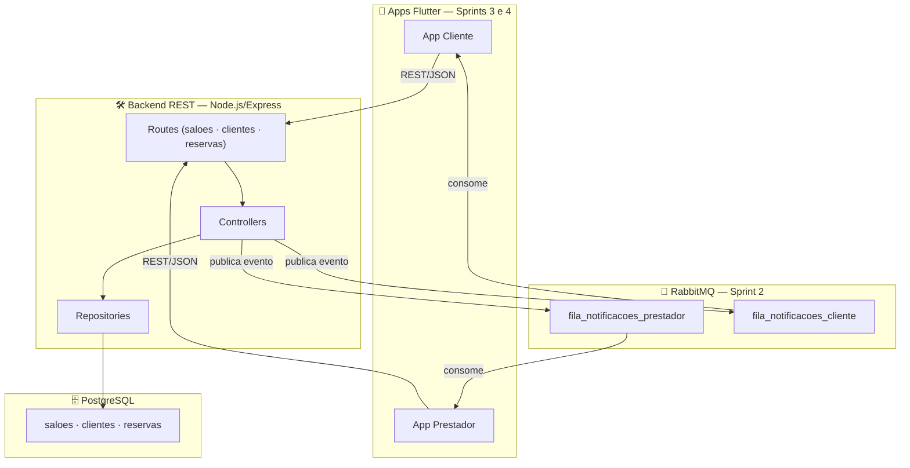

# **SalonManager — `SALON.OS`**

### **Sistema Distribuído para Gestão de Salões de Festas**

> Projeto Integrador · **Lab. de Desenvolvimento de Aplicações Móveis e Distribuídas (LDAMD)**
> Engenharia de Software — **PUC Minas** · 5º Período · Noite · 1º Semestre 2026


---

## **1. Descrição do Projeto (System Overview)**

O **SalonManager** é um sistema distribuído orientado a eventos para **gestão de reservas de salões de festas**. A plataforma conecta dois perfis de usuário em fluxos assíncronos:

- **Cliente** — pesquisa salões, consulta disponibilidade e solicita reservas.
- **Prestador (gestor)** — recebe solicitações em tempo real, confirma/recusa e atualiza o status.

A arquitetura é construída sobre quatro pilares:

| Componente | Tecnologia | Sprint |
|---|---|---|
| Backend REST | Node.js + Express | Sprint 1 ← *atual* |
| MOM (mensageria) | RabbitMQ | Sprint 2 |
| App móvel do cliente | Flutter | Sprint 3 |
| App móvel do prestador | Flutter | Sprint 4 |

---

## **2. Pilha de Tecnologias (Core Stack)**

#### **Backend & API**


#### **Persistência**


#### **Mensageria (MOM)**


#### **Mobile (Sprints 3 e 4)**


#### **DevOps & Ferramentas**


---

## **3. Arquitetura do Sistema**



---

## **4. Endpoints REST**

Base URL: `http://localhost:3000`

### Salões
| Método | Endpoint | Descrição |
|---|---|---|
| `GET` | `/api/saloes` | Lista todos os salões |
| `GET` | `/api/saloes/:id` | Detalhes de um salão |
| `POST` | `/api/saloes` | Cadastra novo salão |

### Clientes
| Método | Endpoint | Descrição |
|---|---|---|
| `GET` | `/api/clientes` | Lista todos os clientes |
| `GET` | `/api/clientes/:id` | Detalhes de um cliente |
| `POST` | `/api/clientes` | Cadastra novo cliente |
| `PUT` | `/api/clientes/:id` | Atualiza dados do cliente |
| `DELETE` | `/api/clientes/:id` | Remove cliente |

### Reservas
| Método | Endpoint | Descrição |
|---|---|---|
| `GET` | `/api/reservas` | Lista reservas (com join de cliente e salão) |
| `GET` | `/api/reservas/:id` | Detalhes de uma reserva |
| `POST` | `/api/reservas` | Cria reserva → publica `NOVA_RESERVA_CRIADA` no MOM |
| `PUT` | `/api/reservas/:id/status` | Atualiza status → publica `STATUS_RESERVA_ATUALIZADO` no MOM |

**Exemplo — criar cliente:**
```bash
curl -X POST http://localhost:3000/api/clientes \
  -H 'Content-Type: application/json' \
  -d '{"nome":"Maria Souza","email":"maria@example.com","telefone":"+55 31 98888-1111"}'
```

**Exemplo — criar reserva:**
```bash
curl -X POST http://localhost:3000/api/reservas \
  -H 'Content-Type: application/json' \
  -d '{"cliente_id":1,"salao_id":1,"data_reserva":"2026-05-10T19:00:00"}'
```

**Exemplo — confirmar reserva (prestador):**
```bash
curl -X PUT http://localhost:3000/api/reservas/1/status \
  -H 'Content-Type: application/json' \
  -d '{"novo_status":"CONFIRMADA"}'
```

> Coleção Postman completa: [postman/SalonManager-Collection.json](postman/SalonManager-Collection.json)

---

## **5. Schema do Banco (PostgreSQL)**

Script: [backend/db/init.sql](backend/db/init.sql)

```sql
saloes   (id PK · nome · endereco · capacidade · descricao)
clientes (id PK · nome · email · telefone)
reservas (id PK · cliente_id FK · salao_id FK · data_reserva · status · created_at)
```

**Ciclo de vida do status:**
```
PENDENTE ──► CONFIRMADA ──► CONCLUIDA
         └─► RECUSADA
```

---

## **6. Eventos do Domínio (MOM — preview Sprint 2)**

| Evento | Disparo | Fila | Consumidor |
|---|---|---|---|
| `NOVA_RESERVA_CRIADA` | `POST /api/reservas` | `fila_notificacoes_prestador` | App prestador |
| `STATUS_RESERVA_ATUALIZADO` | `PUT /api/reservas/:id/status` | `fila_notificacoes_cliente` | App cliente |

---

## **7. Estrutura de Diretórios**

```text
workspace/
├── backend/
│   ├── src/
│   │   ├── config/
│   │   │   └── db.js                          # Pool PostgreSQL
│   │   ├── messaging/
│   │   │   └── publisher.js                   # Publicação RabbitMQ (com fallback)
│   │   ├── modules/
│   │   │   ├── saloes/
│   │   │   │   ├── saloes.repository.js
│   │   │   │   ├── saloes.controller.js
│   │   │   │   └── saloes.routes.js
│   │   │   ├── clientes/
│   │   │   │   ├── clientes.repository.js
│   │   │   │   ├── clientes.controller.js
│   │   │   │   └── clientes.routes.js
│   │   │   └── reservas/
│   │   │       ├── reservas.repository.js
│   │   │       ├── reservas.controller.js
│   │   │       └── reservas.routes.js
│   │   └── app.js                             # Bootstrap Express
│   ├── db/
│   │   └── init.sql                           # Schema + seeds PostgreSQL
│   ├── .env.example
│   ├── Dockerfile
│   ├── package.json
│   └── server.js                              # Entry point
├── postman/
│   └── SalonManager-Collection.json
├── Proposta_Dominio_SalonManager_ArthurAraujoMendonca.pdf
├── docker-compose.yml
├── .gitignore
└── README.md
```

---

## **8. Execução Local**

**Pré-requisito:** Docker Desktop instalado.

```bash
# 1. Clone o repositório
git clone https://github.com/arthur-amx/salon-manager.git
cd salon-manager

# 2. Suba todos os serviços (Postgres + RabbitMQ + Backend)
docker-compose up --build

# 3. Smoke tests
curl http://localhost:3000/api/health    # → {"status":"ok"}
curl http://localhost:3000/api/saloes   # → lista de salões seed
```

| Serviço | URL |
|---|---|
| Backend REST | http://localhost:3000 |
| RabbitMQ Management | http://localhost:15672 (guest/guest) |
| PostgreSQL | localhost:5432 |

> Importe [postman/SalonManager-Collection.json](postman/SalonManager-Collection.json) no Postman para testar todos os endpoints com exemplos de request e response.

---

## **9. Roadmap — 4 Sprints**

| Sprint | Foco | Prazo | Status |
|---|---|---|---|
| **Sprint 1** | Arquitetura + Backend REST | 11/05/2026 | 🟢 concluída |
| **Sprint 2** | Integração MOM (RabbitMQ) | 25/05/2026 | ⚪ pendente |
| **Sprint 3** | App Flutter — Cliente | 15/06/2026 | ⚪ pendente |
| **Sprint 4** | App Flutter — Prestador + Entrega Final | 03/07/2026 | ⚪ pendente |

---

## **10. Critérios — Sprint 1 (20 pts)**

| Critério | Peso | Pts |
|---|---|---|
| Clareza e viabilidade da proposta de domínio | 20% | 4,0 |
| Qualidade e completude do diagrama de arquitetura | 20% | 4,0 |
| Funcionalidade e correção dos endpoints REST | 30% | 6,0 |
| Organização do código (Clean Architecture / boas práticas) | 20% | 4,0 |
| Documentação dos endpoints (coleção de testes) | 10% | 2,0 |
| **TOTAL** | **100%** | **20,0** |

---

## **11. Referências**

- MARTIN, R. C. *Arquitetura Limpa.* Alta Books, 2019.
- HOHPE, G.; WOOLF, B. *Enterprise Integration Patterns.* Addison-Wesley, 2003.
- RICHARDSON, C. *Microservices Patterns.* Manning, 2018.
- COULOURIS, G. et al. *Distributed Systems: Concepts and Design.* 5ª ed. Addison-Wesley, 2011.
- BAILEY, T. *Flutter for Beginners.* 3ª ed. Packt, 2023.

---

> **Autor:** Arthur Araújo Mendonça · Engenharia de Software — PUC Minas · 5º Período/Noite
> **Disciplina:** LDAMD · **Profs.:** Cleiton Silva Tavares e Cristiano de Macedo Neto
