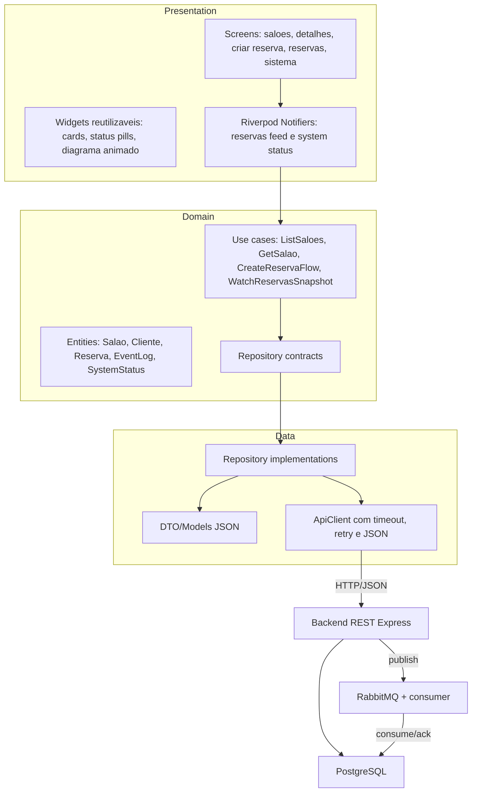

# Sprint 3 - Arquitetura do App Cliente Flutter

## Objetivo

Implementar o app Flutter do cliente do SalonManager com fluxo completo de reserva, consumo do backend REST e atualizacao assincrona de estado por polling. A arquitetura foi organizada por camadas para aproximar o app de Clean Architecture e facilitar a expansao do app do prestador na Sprint 4.

## Camadas

## Fluxo funcional da Sprint 3

1. O cliente abre a tela de saloes e o app consome `GET /api/saloes`.
2. O cliente abre detalhes de um salao via `GET /api/saloes/:id`.
3. O cliente preenche os dados e envia uma reserva.
4. O app cria o cliente com `POST /api/clientes`.
5. O app cria a reserva com `POST /api/reservas`.
6. O backend publica `NOVA_RESERVA_CRIADA` no RabbitMQ.
7. O consumer processa a mensagem e persiste em `event_log`.
8. O app atualiza automaticamente as reservas e o event log por polling a cada 6 segundos.

## Atualizacao assincrona de estado

A Sprint 3 permite MOM, WebSocket ou polling assincrono. Nesta versao, o app usa polling controlado por Riverpod:

- `ReservasFeedController` dispara sincronizacao periodica a cada 6 segundos.
- A sincronizacao le `GET /api/reservas` e `GET /api/event-log?limit=24`.
- O usuario nao precisa atualizar manualmente para ver novas reservas ou eventos processados.
- O `ApiClient` aplica timeout e retry para reduzir falhas transientes de rede.

## Observabilidade e resiliencia

Foi adicionado o endpoint `GET /api/system/status`, consumido pela tela Sistema:

- disponibilidade da API;
- latencia do PostgreSQL;
- estado do publisher RabbitMQ;
- filas duraveis conhecidas;
- estrategia de retry, polling e evolucao para a Sprint 4.

Essa tela tambem inclui um diagrama animado mostrando o caminho Flutter -> REST -> RabbitMQ -> Consumer -> PostgreSQL/event_log. A ideia e tornar visivel o comportamento distribuido, nao apenas o CRUD.

## Mitigacao de falha unica

Na Sprint 3, a mitigacao ja aparece em tres pontos:

- app com timeout, retry e estados de erro claros;
- backend com health detalhado de banco e mensageria;
- RabbitMQ com filas duraveis e consumer separado.

Para a Sprint 4, a extensao natural e replicar backend e consumer atras de um balanceador, manter o RabbitMQ gerenciado/clusterizado e adicionar o app do prestador consumindo o fluxo completo de aceite/recusa.
